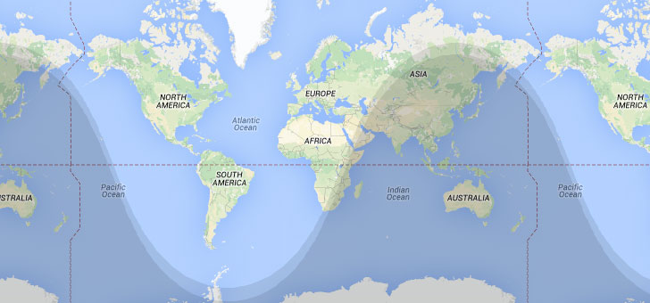

# Nite Overlay - Overview

Generates an overlay to illustrate the day/night cycle.
There are 4 shade levels going from light to dark.
They are civil twilight, nautical twilight, astronomical twilight and night.

Works with Google Maps API v3

The sun position is estimated using an adapted method from NOAA's solar calculator, which is based on equations from Astronomical Algorithms, by Jean Meeus.  
More details: http://www.esrl.noaa.gov/gmd/grad/solcalc/calcdetails.html

*Might not work on some mobile devices. I've not explored the reason for this*

## Quick start

```javascript
var map = google.maps.Map(...);
nite.init(map);
```
Use `refresh()` method to update the overlay periodically. Perhaps via `setInterval()`;

```
setInterval(function() { nite.refresh() }, 10000); // every 10s
```

Alternatively, a specific date can be selected via `setDate()` followed by a call to `refresh()` to redraw the overlay. Setting the date to `null` will cause nite overlay to use current date and time.

Note: *If the overlay is hidden and refresh() is called, the overlay position will not be updated.  
Not until the overlay is visible again.*

## Available methods

`nite.setMap()` set a specific map object  
`nite.setDate(Date object)` set a specific datetime, or `null` to use current datetime  
`nite.calculatePositionOfSun(Date object)` returns LatLng for the specified date (has no effect on the overlay)  
`nite.refresh()` Recalculate and refresh the position of the overlay  
`nite.isVisible()` returns a boolean if the overlay is visible on the map  
`nite.show()` Make the overlay visible  
`nite.hide()` Hide the overlay  
`nite.getSunPosition()` returns LatLng for the Sun  
`nite.getShadowPosition()` returns LatLng for the night side  

